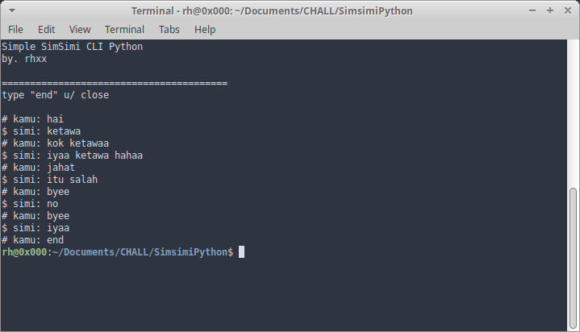

# Simsimi Python

Simple Simsimi Chat. Penggunaan API simsimi di python.

## Installation

```bash
$ sudo pip install requests
$ git clone https://github.com/rohmnnn/SimsimiPython.git
$ cd SimsimiPython
$ python simsimi.py
```

# Screenshoot



